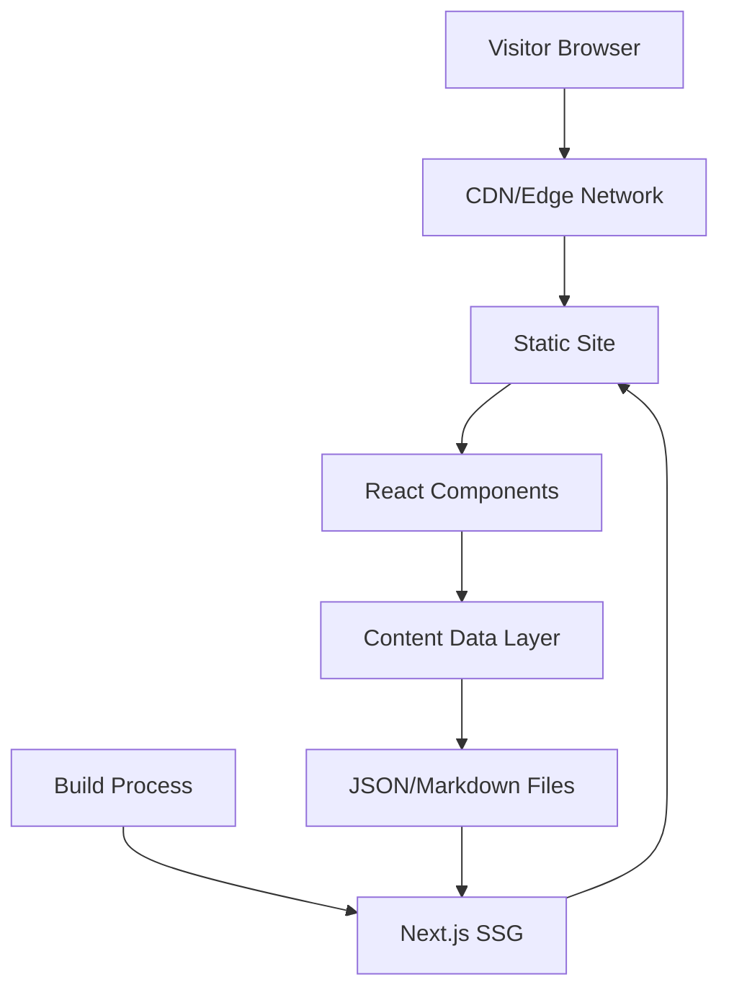

# Personal Website Design Document

## Overview

This document outlines the technical design for scottryanhoward.info, a personal website serving as a digital resume. The site will be built as a modern, static single-page application (SPA) with a focus on performance, accessibility, and maintainability. The design prioritizes fast load times, SEO optimization, and a clean, professional aesthetic.

### Technology Stack

- **Framework**: React with Next.js (for SSG/SSR capabilities, SEO, and performance)
- **Styling**: Tailwind CSS (for responsive design and rapid development)
- **Deployment**: Vercel or Netlify (for automatic deployments and CDN distribution)
- **Content Management**: JSON/Markdown files (for easy content updates without rebuilding)
- **Icons**: React Icons or Lucide React
- **Animations**: Framer Motion (for smooth, performant animations)

### Design Principles

1. **Mobile-First**: Design for mobile devices first, then scale up
2. **Performance**: Optimize for Core Web Vitals (LCP, FID, CLS)
3. **Accessibility**: WCAG 2.1 Level AA compliance
4. **SEO**: Server-side rendering with proper meta tags and structured data
5. **Maintainability**: Separation of content from code for easy updates

## Architecture

### High-Level Architecture



### Application Structure

```
/
├── public/
│   ├── images/
│   │   ├── profile.jpg
│   │   ├── projects/
│   │   └── companies/
│   ├── resume.pdf
│   ├── favicon.ico
│   └── robots.txt
├── src/
│   ├── components/
│   │   ├── layout/
│   │   │   ├── Header.tsx
│   │   │   ├── Footer.tsx
│   │   │   └── Navigation.tsx
│   │   ├── sections/
│   │   │   ├── Hero.tsx
│   │   │   ├── About.tsx
│   │   │   ├── Experience.tsx
│   │   │   ├── Skills.tsx
│   │   │   ├── WorkProjects.tsx
│   │   │   ├── PersonalProjects.tsx
│   │   │   ├── Education.tsx
│   │   │   └── Contact.tsx
│   │   ├── ui/
│   │   │   ├── Button.tsx
│   │   │   ├── Card.tsx
│   │   │   ├── Timeline.tsx
│   │   │   └── SkillBadge.tsx
│   │   └── ProjectCard.tsx
│   ├── data/
│   │   ├── profile.json
│   │   ├── experience.json
│   │   ├── skills.json
│   │   ├── workProjects.json
│   │   ├── personalProjects.json
│   │   └── education.json
│   ├── lib/
│   │   ├── analytics.ts
│   │   └── utils.ts
│   ├── styles/
│   │   └── globals.css
│   ├── types/
│   │   └── index.ts
│   └── pages/
│       ├── _app.tsx
│       ├── _document.tsx
│       ├── index.tsx
│       └── api/
│           └── contact.ts (optional)
├── tailwind.config.js
├── next.config.js
├── tsconfig.json
└── package.json
```

## Components and Interfaces

### Core Data Models

#### Profile Interface
```typescript
interface Profile {
  name: string;
  title: string;
  summary: string;
  email: string;
  phone?: string;
  location: string;
  profileImage: string;
  socialLinks: SocialLink[];
}

interface SocialLink {
  platform: string;
  url: string;
  icon: string;
}
```

#### Experience Interface
```typescript
interface Experience {
  id: string;
  company: string;
  companyLogo?: string;
  position: string;
  location: string;
  startDate: string;
  endDate: string | 'Present';
  description: string;
  responsibilities: string[];
  achievements: string[];
  technologies: string[];
  relatedProjects: string[]; // Project IDs
}
```

#### Project Interfaces
```typescript
interface WorkProject {
  id: string;
  title: string;
  description: string;
  longDescription: string;
  technologies: string[];
  companyId: string; // Links to experience
  experienceId: string; // Links to specific role
  images: string[];
  demoUrl?: string;
  repoUrl?: string;
  featured: boolean;
  startDate: string;
  endDate?: string;
}

interface PersonalProject {
  id: string;
  title: string;
  description: string;
  longDescription: string;
  motivation: string; // Why this project was created
  technologies: string[];
  images: string[];
  demoUrl?: string;
  repoUrl?: string;
  featured: boolean;
  startDate: string;
  endDate?: string;
  status: 'completed' | 'in-progress' | 'archived';
}
```

#### Skill Interface
```typescript
interface Skill {
  name: string;
  category: string;
  proficiency?: 'beginner' | 'intermediate' | 'advanced' | 'expert';
  yearsOfExperience?: number;
}

interface SkillCategory {
  name: string;
  skills: Skill[];
}
```

#### Education Interface
```typescript
interface Education {
  id: string;
  institution: string;
  degree: string;
  field: string;
  location: string;
  startDate: string;
  endDate: string;
  gpa?: string;
  honors?: string[];
  description?: string;
}

interface Certification {
  id: string;
  name: string;
  issuer: string;
  issueDate: string;
  expiryDate?: string;
  credentialId?: string;
  credentialUrl?: string;
}
```

### Component Architecture

#### Layout Components

**Header Component**
- Sticky navigation bar
- Logo/name on left
- Navigation links (smooth scroll to sections)
- Mobile hamburger menu
- Theme toggle (optional dark mode)

**Navigation Component**
- Smooth scrolling to sections
- Active section highlighting
- Responsive mobile menu
- Accessibility: keyboard navigation and ARIA labels

**Footer Component**
- Copyright information
- Social links
- Quick links to sections
- "Back to top" button

#### Section Components

**Hero Section**
- Full viewport height
- Profile image with subtle animation
- Name and title with typewriter effect (optional)
- Brief tagline
- CTA buttons (View Work, Download Resume, Contact)
- Scroll indicator

**About Section**
- Professional summary
- Key highlights/quick facts
- Contact information
- Social media links

**Experience Section**
- Timeline layout (vertical on mobile, can be horizontal on desktop)
- Each entry shows company, role, dates, description
- Expandable details for responsibilities and achievements
- Technology tags
- Links to related projects
- Company logos

**Skills Section**
- Grouped by category (Languages, Frameworks, Tools, etc.)
- Visual representation (badges, pills, or cards)
- Optional: skill proficiency indicators
- Filterable/searchable (optional enhancement)

**Work Projects Section**
- Grid layout (1 column mobile, 2-3 columns desktop)
- Project cards with images
- Modal or dedicated view for project details
- Links to live demos and repositories
- Clear indication of associated work experience and company
- Technology tags

**Personal Projects Section**
- Separate section from work projects
- Grid layout (1 column mobile, 2-3 columns desktop)
- Project cards highlighting personal initiative
- Motivation/purpose for each project
- Links to live demos and repositories (especially GitHub)
- Technology tags
- Date/time period indicators

**Education Section**
- Timeline or card layout
- Degrees and certifications
- Institution logos (optional)
- Expandable details for honors and descriptions

**Contact Section**
- Multiple contact methods
- Email link (mailto)
- Social media links
- Resume download button
- Optional: Simple contact form (if backend is added later)

### UI Components

**Card Component**
- Reusable container with consistent styling
- Hover effects
- Shadow and border styling
- Responsive padding

**Timeline Component**
- Vertical timeline with date markers
- Connecting lines between entries
- Responsive design
- Animation on scroll

**Button Component**
- Primary, secondary, and outline variants
- Icon support
- Loading states
- Accessibility: focus states and ARIA labels

**SkillBadge Component**
- Pill-shaped badges
- Category-based color coding
- Hover effects

**ProjectCard Component**
- Image thumbnail
- Title and brief description
- Technology tags
- Action buttons (View Details, Demo, Code)
- Work/Personal indicator

## Data Models

### Content Data Structure

All content will be stored in JSON files within the `src/data/` directory. This allows for easy updates without code changes.

**profile.json**
```json
{
  "name": "Scott Ryan Howard",
  "title": "Software Engineer",
  "summary": "Experienced software engineer...",
  "email": "contact@scottryanhoward.info",
  "location": "City, State",
  "profileImage": "/images/profile.jpg",
  "socialLinks": [
    {
      "platform": "LinkedIn",
      "url": "https://linkedin.com/in/...",
      "icon": "linkedin"
    }
  ]
}
```

**experience.json**
```json
[
  {
    "id": "exp-1",
    "company": "Company Name",
    "position": "Senior Software Engineer",
    "location": "City, State",
    "startDate": "2020-01",
    "endDate": "Present",
    "description": "Brief role description",
    "responsibilities": ["Responsibility 1", "Responsibility 2"],
    "achievements": ["Achievement 1", "Achievement 2"],
    "technologies": ["React", "Node.js", "AWS"],
    "relatedProjects": ["proj-1", "proj-2"]
  }
]
```

**workProjects.json**
```json
[
  {
    "id": "work-proj-1",
    "title": "Enterprise Dashboard",
    "description": "Brief description",
    "longDescription": "Detailed description...",
    "technologies": ["React", "TypeScript", "AWS"],
    "companyId": "company-1",
    "experienceId": "exp-1",
    "images": ["/images/projects/work-proj-1-1.jpg"],
    "demoUrl": "https://demo.example.com",
    "featured": true,
    "startDate": "2021-03",
    "endDate": "2021-08"
  }
]
```

**personalProjects.json**
```json
[
  {
    "id": "personal-proj-1",
    "title": "Open Source Library",
    "description": "Brief description",
    "longDescription": "Detailed description...",
    "motivation": "Wanted to solve a common problem I encountered...",
    "technologies": ["TypeScript", "Node.js"],
    "images": ["/images/projects/personal-proj-1-1.jpg"],
    "repoUrl": "https://github.com/username/project",
    "featured": true,
    "startDate": "2022-01",
    "status": "completed"
  }
]
```

### Data Relationships

- Work Projects reference Experience via `experienceId` and `companyId`
- Experience lists related work projects via `relatedProjects` array
- Bidirectional linking allows navigation between experience and work projects
- Personal Projects are independent and don't link to experience
- Skills can be extracted from Experience, Work Projects, and Personal Projects for consistency
- Both project types share similar display patterns but are stored and managed separately

## Error Handling

### Client-Side Error Handling

1. **Missing Data**: Gracefully handle missing or incomplete data
   - Display placeholder content or hide sections with no data
   - Log warnings in development mode

2. **Image Loading Errors**: 
   - Provide fallback images
   - Use Next.js Image component with blur placeholders

3. **Navigation Errors**:
   - Smooth scroll fallback for browsers without support
   - Ensure all internal links work correctly

4. **External Link Errors**:
   - Open external links in new tabs
   - Add rel="noopener noreferrer" for security

### Build-Time Validation

1. **Data Validation**:
   - Validate JSON structure against TypeScript interfaces
   - Check for required fields
   - Validate date formats
   - Ensure project-experience relationships are valid

2. **Asset Validation**:
   - Verify all referenced images exist
   - Check PDF resume exists
   - Validate external URLs (optional)

## Testing Strategy

### Unit Testing

**Framework**: Jest + React Testing Library

**Test Coverage**:
- Component rendering tests
- User interaction tests (clicks, navigation)
- Data transformation utilities
- Accessibility tests (ARIA labels, keyboard navigation)

**Example Test Cases**:
```typescript
// Hero.test.tsx
describe('Hero Component', () => {
  it('renders profile name and title', () => {});
  it('displays CTA buttons', () => {});
  it('handles resume download click', () => {});
});

// Experience.test.tsx
describe('Experience Component', () => {
  it('renders all experience entries', () => {});
  it('displays entries in chronological order', () => {});
  it('links to related projects', () => {});
});
```

### Integration Testing

**Framework**: Playwright or Cypress

**Test Scenarios**:
- Full page navigation flow
- Smooth scrolling between sections
- Mobile menu functionality
- Project filtering and detail views
- External link opening
- Resume download

### Accessibility Testing

**Tools**: 
- axe-core (automated testing)
- Manual keyboard navigation testing
- Screen reader testing (NVDA/JAWS)

**Test Cases**:
- Keyboard navigation through all interactive elements
- Screen reader announces all content correctly
- Color contrast meets WCAG AA standards
- Focus indicators are visible
- ARIA labels are present and correct

### Performance Testing

**Tools**:
- Lighthouse CI
- WebPageTest
- Chrome DevTools Performance panel

**Metrics to Monitor**:
- First Contentful Paint (FCP) < 1.8s
- Largest Contentful Paint (LCP) < 2.5s
- Time to Interactive (TTI) < 3.5s
- Cumulative Layout Shift (CLS) < 0.1
- Total Blocking Time (TBT) < 200ms

**Optimization Strategies**:
- Image optimization (WebP format, responsive images)
- Code splitting and lazy loading
- Font optimization (font-display: swap)
- Minimize JavaScript bundle size
- Use Next.js Image component for automatic optimization

### SEO Testing

**Validation**:
- Meta tags present and correct
- Open Graph tags for social sharing
- Structured data (JSON-LD) validation
- Sitemap.xml generation
- robots.txt configuration
- Semantic HTML structure

## Responsive Design Strategy

### Breakpoints

```css
/* Mobile: < 640px (default) */
/* Tablet: 640px - 1024px */
/* Desktop: > 1024px */
/* Large Desktop: > 1280px */
```

### Layout Adaptations

**Mobile (< 640px)**:
- Single column layout
- Stacked navigation (hamburger menu)
- Full-width cards
- Simplified timeline (vertical only)
- Touch-optimized buttons and links

**Tablet (640px - 1024px)**:
- Two-column grid for projects
- Expanded navigation (may still use hamburger)
- Larger typography
- More whitespace

**Desktop (> 1024px)**:
- Three-column grid for projects
- Full horizontal navigation
- Sidebar navigation (optional)
- Larger images and more visual hierarchy
- Hover effects and animations

## Performance Optimization

### Image Optimization
- Use Next.js Image component
- Serve WebP format with fallbacks
- Implement lazy loading
- Use appropriate image sizes for different viewports
- Compress images (target < 200KB per image)

### Code Optimization
- Code splitting by route and component
- Tree shaking to remove unused code
- Minification and compression
- Use dynamic imports for heavy components

### Caching Strategy
- Static assets cached with long TTL
- Service worker for offline support (optional)
- CDN caching for global distribution

### Font Optimization
- Use system fonts or limit custom fonts to 1-2 families
- Subset fonts to include only needed characters
- Use font-display: swap to prevent FOIT

## Deployment and Hosting

### Recommended Platform: Vercel

**Benefits**:
- Automatic deployments from Git
- Built-in CDN
- Excellent Next.js support
- Free SSL certificates
- Preview deployments for PRs
- Analytics and performance monitoring

### Custom Domain Setup
- Configure DNS for scottryanhoward.info
- Point to Vercel nameservers or use A/CNAME records
- Enable HTTPS (automatic with Vercel)

### Environment Configuration
- Production environment for main branch
- Preview environments for development branches
- Environment variables for analytics keys (if needed)

## Future Enhancements

### Phase 2 Considerations
- Blog section for articles and posts
- Dark mode toggle
- Contact form with backend (using Vercel serverless functions)
- Analytics integration (Google Analytics, Plausible, or Fathom)
- Internationalization (i18n) support
- Admin panel for content management
- Testimonials/recommendations section
- Interactive resume timeline with animations

### Maintenance Plan
- Regular content updates via JSON files
- Dependency updates (monthly)
- Performance monitoring and optimization
- SEO monitoring and improvements
- Accessibility audits (quarterly)
