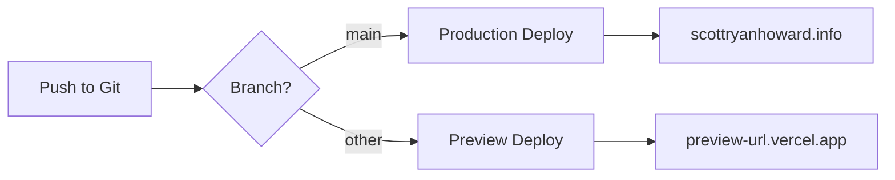

# Deployment Guide

This guide provides comprehensive instructions for deploying your personal website to production using Vercel, including custom domain configuration for scottryanhoward.info.

## Table of Contents

- [Prerequisites](#prerequisites)
- [Initial Setup](#initial-setup)
- [Vercel Deployment](#vercel-deployment)
- [Custom Domain Configuration](#custom-domain-configuration)
- [Environment Variables](#environment-variables)
- [Continuous Deployment](#continuous-deployment)
- [Post-Deployment Verification](#post-deployment-verification)
- [Monitoring and Maintenance](#monitoring-and-maintenance)
- [Troubleshooting](#troubleshooting)
- [Alternative Deployment Options](#alternative-deployment-options)

## Prerequisites

Before deploying, ensure you have:

- ✅ A GitHub, GitLab, or Bitbucket account
- ✅ Your repository pushed to a remote Git provider
- ✅ A Vercel account (free tier is sufficient)
- ✅ Domain name registered (scottryanhoward.info)
- ✅ Access to domain DNS settings

## Initial Setup

### 1. Prepare Your Repository

Ensure your code is ready for deployment:

```bash
# Run tests
npm run test:run
npm run test:e2e

# Build locally to verify
npm run build

# Check for linting errors
npm run lint

# Commit any final changes
git add .
git commit -m "Prepare for deployment"
git push origin main
```

### 2. Verify Production Build

Test the production build locally:

```bash
# Build for production
npm run build

# Start production server
npm start
```

Visit `http://localhost:3000` and verify:
- All sections load correctly
- Images display properly
- Links work as expected
- Resume downloads successfully
- No console errors

## Vercel Deployment

### Step 1: Create Vercel Account

1. Go to [vercel.com](https://vercel.com)
2. Click "Sign Up"
3. Choose "Continue with GitHub" (recommended)
4. Authorize Vercel to access your repositories

### Step 2: Import Project

1. Click "Add New..." → "Project"
2. Select your repository from the list
3. If not visible, click "Adjust GitHub App Permissions"

### Step 3: Configure Project

Vercel will auto-detect Next.js settings:

```
Framework Preset: Next.js
Build Command: npm run build
Output Directory: .next
Install Command: npm install
Development Command: npm run dev
```

**Root Directory**: Leave as `./` (unless your Next.js app is in a subdirectory)

### Step 4: Deploy

1. Click "Deploy"
2. Wait for the build to complete (usually 1-2 minutes)
3. You'll receive a deployment URL: `https://your-project.vercel.app`

### Step 5: Verify Deployment

Visit your Vercel URL and check:
- ✅ Site loads correctly
- ✅ All sections are visible
- ✅ Images load properly
- ✅ Navigation works
- ✅ Resume downloads
- ✅ External links open correctly

## Custom Domain Configuration

### Option 1: Using Vercel Nameservers (Recommended)

This is the simplest method and provides the best performance.

#### Step 1: Add Domain in Vercel

1. Go to your project in Vercel
2. Click "Settings" → "Domains"
3. Enter `scottryanhoward.info`
4. Click "Add"

#### Step 2: Update Nameservers

Vercel will provide nameservers (e.g., `ns1.vercel-dns.com`):

1. Log in to your domain registrar (GoDaddy, Namecheap, etc.)
2. Find DNS/Nameserver settings
3. Replace existing nameservers with Vercel's nameservers:
   ```
   ns1.vercel-dns.com
   ns2.vercel-dns.com
   ```
4. Save changes

#### Step 3: Wait for Propagation

- DNS changes can take 24-48 hours to propagate
- Check status in Vercel dashboard
- Use [whatsmydns.net](https://www.whatsmydns.net) to monitor propagation

#### Step 4: Add www Subdomain (Optional)

1. In Vercel, add `www.scottryanhoward.info`
2. Vercel will automatically redirect www to non-www (or vice versa)

### Option 2: Using A and CNAME Records

If you prefer to keep your current nameservers:

#### Step 1: Get Vercel IP Address

In Vercel dashboard, you'll see:
```
A Record: 76.76.21.21
```

#### Step 2: Configure DNS Records

In your domain registrar's DNS settings:

**For root domain (scottryanhoward.info):**
```
Type: A
Name: @
Value: 76.76.21.21
TTL: 3600
```

**For www subdomain:**
```
Type: CNAME
Name: www
Value: cname.vercel-dns.com
TTL: 3600
```

#### Step 3: Verify in Vercel

1. Return to Vercel dashboard
2. Click "Verify" next to your domain
3. Wait for SSL certificate to be issued (automatic)

### SSL Certificate

Vercel automatically provisions SSL certificates:
- Free SSL via Let's Encrypt
- Automatic renewal
- HTTPS enforced by default
- No configuration needed

## Environment Variables

### Local Development

Create `.env.local` for local environment variables:

```bash
# Copy example file
cp .env.local.example .env.local

# Edit with your values
# Example variables:
NEXT_PUBLIC_SITE_URL=http://localhost:3000
NEXT_PUBLIC_GA_ID=G-XXXXXXXXXX
```

### Production Environment

Add environment variables in Vercel:

1. Go to "Settings" → "Environment Variables"
2. Add each variable:
   - **Key**: Variable name (e.g., `NEXT_PUBLIC_GA_ID`)
   - **Value**: Variable value
   - **Environment**: Select Production, Preview, or Development
3. Click "Save"

**Important**: Variables prefixed with `NEXT_PUBLIC_` are exposed to the browser.

### Common Environment Variables

```bash
# Site URL
NEXT_PUBLIC_SITE_URL=https://scottryanhoward.info

# Analytics (optional)
NEXT_PUBLIC_GA_ID=G-XXXXXXXXXX
NEXT_PUBLIC_PLAUSIBLE_DOMAIN=scottryanhoward.info

# Contact Form (if implemented)
SENDGRID_API_KEY=SG.xxxxxxxxxxxxx
CONTACT_EMAIL=contact@scottryanhoward.info
```

## Continuous Deployment

### Automatic Deployments

Vercel automatically deploys when you push to Git:

**Production Deployments** (main branch):
```bash
git add .
git commit -m "Update content"
git push origin main
```

**Preview Deployments** (other branches):
```bash
git checkout -b feature/new-section
git add .
git commit -m "Add new section"
git push origin feature/new-section
```

Each push creates a unique preview URL for testing.

### Deployment Workflow



### Branch Configuration

Configure which branches trigger deployments:

1. Go to "Settings" → "Git"
2. Set "Production Branch" to `main`
3. Enable/disable preview deployments for other branches

### Deployment Hooks

Create deployment hooks for external triggers:

1. Go to "Settings" → "Git" → "Deploy Hooks"
2. Click "Create Hook"
3. Name it (e.g., "Content Update")
4. Select branch (e.g., `main`)
5. Copy the webhook URL

Trigger deployments via HTTP POST:
```bash
curl -X POST https://api.vercel.com/v1/integrations/deploy/...
```

## Post-Deployment Verification

### Checklist

After deployment, verify the following:

#### Functionality
- [ ] All sections load correctly
- [ ] Navigation works (smooth scrolling)
- [ ] Mobile menu functions properly
- [ ] Images display correctly
- [ ] Resume downloads successfully
- [ ] External links open in new tabs
- [ ] Social media links work

#### Performance
- [ ] Run Lighthouse audit (target 90+ scores)
- [ ] Check Core Web Vitals in Vercel Analytics
- [ ] Test on slow 3G connection
- [ ] Verify image optimization

#### SEO
- [ ] Meta tags present (view page source)
- [ ] Open Graph tags for social sharing
- [ ] Sitemap accessible at `/sitemap.xml`
- [ ] Robots.txt accessible at `/robots.txt`
- [ ] Structured data validates (use Google Rich Results Test)

#### Accessibility
- [ ] Keyboard navigation works
- [ ] Screen reader compatibility
- [ ] Color contrast meets WCAG AA
- [ ] Focus indicators visible
- [ ] ARIA labels present

#### Cross-Browser Testing
- [ ] Chrome (latest)
- [ ] Firefox (latest)
- [ ] Safari (latest)
- [ ] Edge (latest)
- [ ] Mobile Safari (iOS)
- [ ] Chrome Mobile (Android)

### Performance Testing

Run Lighthouse audit:
```bash
npm run lighthouse
```

Or use online tools:
- [PageSpeed Insights](https://pagespeed.web.dev/)
- [WebPageTest](https://www.webpagetest.org/)
- [GTmetrix](https://gtmetrix.com/)

### SEO Validation

- [Google Search Console](https://search.google.com/search-console)
- [Google Rich Results Test](https://search.google.com/test/rich-results)
- [Bing Webmaster Tools](https://www.bing.com/webmasters)

## Monitoring and Maintenance

### Vercel Analytics

Enable analytics in Vercel dashboard:
1. Go to "Analytics" tab
2. Enable Web Analytics (free)
3. View real-time performance metrics

Metrics tracked:
- Page views
- Unique visitors
- Core Web Vitals (LCP, FID, CLS)
- Top pages
- Referrers

### Error Monitoring

Monitor errors in Vercel:
1. Go to "Deployments" tab
2. Click on a deployment
3. View "Build Logs" and "Function Logs"

For advanced monitoring, integrate:
- [Sentry](https://sentry.io/) - Error tracking
- [LogRocket](https://logrocket.com/) - Session replay
- [Datadog](https://www.datadoghq.com/) - Full-stack monitoring

### Uptime Monitoring

Use uptime monitoring services:
- [UptimeRobot](https://uptimerobot.com/) (free)
- [Pingdom](https://www.pingdom.com/)
- [StatusCake](https://www.statuscake.com/)

### Regular Maintenance

**Weekly**:
- Check Vercel deployment status
- Review analytics for traffic patterns
- Monitor error logs

**Monthly**:
- Update dependencies: `npm update`
- Run security audit: `npm audit`
- Review and update content
- Check broken links

**Quarterly**:
- Run full accessibility audit
- Performance optimization review
- SEO audit and improvements
- Update resume PDF

## Troubleshooting

### Build Failures

**Error: Build failed**
```bash
# Check build logs in Vercel dashboard
# Common causes:
# - TypeScript errors
# - Missing dependencies
# - Environment variables not set

# Test build locally
npm run build
```

**Error: Module not found**
```bash
# Ensure all dependencies are in package.json
npm install

# Clear cache and rebuild
rm -rf .next node_modules
npm install
npm run build
```

### Domain Issues

**Domain not resolving**
- Wait 24-48 hours for DNS propagation
- Verify DNS records are correct
- Use `dig scottryanhoward.info` to check DNS
- Clear browser DNS cache

**SSL Certificate Error**
- Wait for automatic certificate provisioning (can take up to 24 hours)
- Verify domain ownership in Vercel
- Check that DNS records point to Vercel

### Performance Issues

**Slow page load**
- Check image sizes (should be < 200KB each)
- Review bundle size: `npm run analyze`
- Enable Vercel Edge Network
- Optimize images with Next.js Image component

**High CLS (Cumulative Layout Shift)**
- Add explicit width/height to images
- Reserve space for dynamic content
- Use font-display: swap

### Deployment Not Triggering

**Push doesn't trigger deployment**
- Check Vercel Git integration is connected
- Verify branch is configured for deployment
- Check deployment logs for errors
- Manually trigger deployment in Vercel dashboard

## Alternative Deployment Options

### Netlify

1. Connect repository to Netlify
2. Configure build settings:
   ```
   Build command: npm run build
   Publish directory: .next
   ```
3. Add environment variables
4. Deploy

### AWS Amplify

1. Connect repository to Amplify
2. Auto-detect Next.js settings
3. Configure custom domain
4. Deploy

### Self-Hosted (VPS)

```bash
# On your server
git clone <repository-url>
cd personal-website
npm install
npm run build

# Use PM2 for process management
npm install -g pm2
pm2 start npm --name "personal-website" -- start
pm2 save
pm2 startup
```

Configure Nginx as reverse proxy:
```nginx
server {
    listen 80;
    server_name scottryanhoward.info;

    location / {
        proxy_pass http://localhost:3000;
        proxy_http_version 1.1;
        proxy_set_header Upgrade $http_upgrade;
        proxy_set_header Connection 'upgrade';
        proxy_set_header Host $host;
        proxy_cache_bypass $http_upgrade;
    }
}
```

## Support

### Resources

- [Vercel Documentation](https://vercel.com/docs)
- [Next.js Deployment](https://nextjs.org/docs/deployment)
- [Vercel Community](https://github.com/vercel/vercel/discussions)

### Getting Help

- Check Vercel status: [vercel-status.com](https://www.vercel-status.com/)
- Vercel Support: support@vercel.com
- Community Discord: [vercel.com/discord](https://vercel.com/discord)

---

Last updated: October 2025
